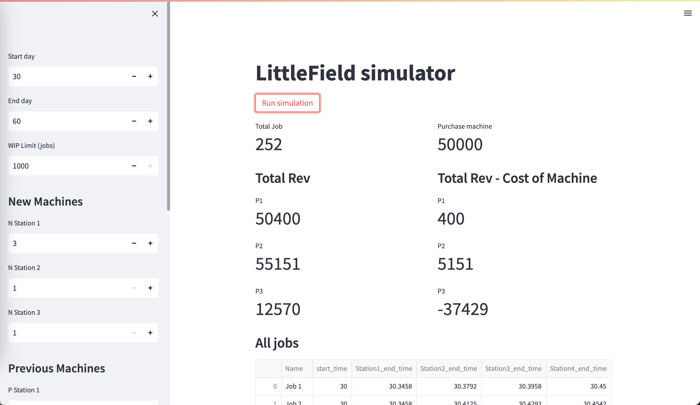
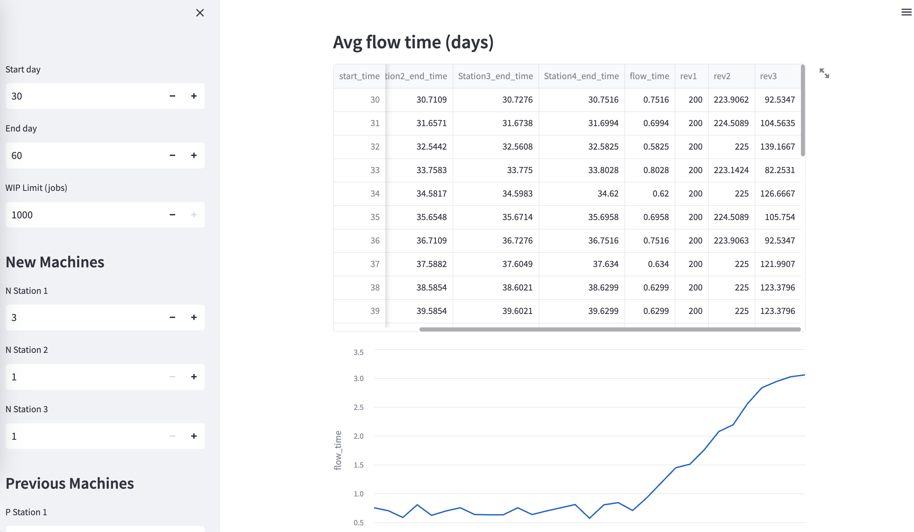

# Littlefield simulator

**Simulator to simulate multiple scenarios to play Littlefield game**

## Run

Open a terminal and run:

```bash
$ git clone git@github.com:cynw/littlefield.git
$ cd littlefield
$ pip install -r requirements.txt
$ streamlit run main.py
```

## Screenshots


